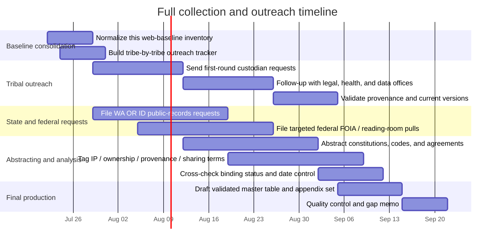

# Tribal Data Sovereignty in Washington Oregon and Idaho

## Executive summary

This report maps the current, publicly discoverable landscape of tribal data sovereignty, data sharing, data ownership, provenance, governance, intellectual property, and related law for the 43 federally recognized Tribes in the Washington–Oregon–Idaho policy region served by the Northwest Tribal Epidemiology Center. The strongest online primary materials are not a single unified body of “tribal data law,” but a layered mix of tribal constitutions and codes, tribe-specific research controls, state public-health data instruments, federal trust- and consultation-based authorities, and intertribal model frameworks such as CARE and Local Contexts. In the current web-visible corpus, explicit tribe-specific data-governance policies remain comparatively rare; the clearest tribe-specific instruments located were the Nez Perce Tribe’s research-permit regulations, Washington’s Tulalip-specific health-data sharing agreement, and a set of openly published tribal constitutions and codes for a smaller subset of tribes. citeturn12view1turn4search1turn15search1turn34search17turn31search2turn32search11

Washington currently has the most visible state implementation infrastructure for tribal data access in the region. The Washington Department of Health has built a Tribal Data Hub pathway through amended data-sharing agreements with the Northwest Tribal Epidemiology Center, published a Tribal Data Sharing Agreement template and consultation closeout, recognized “tribal public health authority” in statute, and waived certain patient-discharge-data fees for Tribes and Tribal Epidemiology Centers. Washington also publicly announced a tribe-specific agreement with the Tulalip Tribes in early 2025. citeturn9view0turn15search13turn15search3turn15search4turn15search1

Oregon currently has the most active tribe-specific legislative reform agenda. Senate Bill 841 was signed in 2025 and authorizes the Oregon Health Authority to enter agreements with federally recognized Tribes in Oregon and tribal epidemiology centers for reportable-disease and PDMP-related data sharing. Senate Bill 835, by contrast, remained in committee in the current review, but would direct OHA to adopt rules governing the collection, storage, and use of tribal affiliation data in collaboration with Oregon’s nine federally recognized Tribes; OHA’s own 2025 bill summaries expressly state that tribal-specific data would belong to each individual Tribe and that governance rules must be developed before collection. citeturn14view0turn14view1turn9view2turn9view3

Idaho’s web-visible record is thinner on tribe-specific health-data policy, but public primary sources do show state–tribal data sharing in other regulated domains. The clearest examples identified were the Idaho–Nez Perce wolf-management Memorandum of Agreement, which expressly provides for state–tribal data sharing, Idaho’s transparency records for Shoshone-Bannock Tribal TANF data-sharing arrangements, and Idaho water-rule materials recognizing the Shoshone-Bannock Tribal Water Resources Department as an important data-sharing partner. citeturn17search2turn19search3turn19search17turn17search0

At the federal level, the core legal backbone is still self-determination, trust responsibility, consultation, and health authority rather than a single codified federal “tribal data sovereignty act.” The most operationally important sources located were the Indian Self-Determination and Education Assistance Act, the Indian Health Care Improvement Act and its Tribal Epidemiology Center authorities, Executive Order 13175, HHS’s 2024 Tribal and Tribal Epidemiology Center Data Access Policy, NIH guidance on Tribal sovereignty under the Data Management and Sharing Policy, ONC’s tribal-affiliation interoperability work, DOI/BIA consultation materials on tribal data priorities, and DOI’s Indigenous Knowledge guidance. citeturn20search4turn20search5turn20search3turn21search5turn23search4turn21search2turn22search2turn22search12

## Scope and method

This is a primary-source-first review focused on documents that are online and currently accessible from official tribal, state, or federal sites, with secondary literature included only where it helps interpret the legal or policy significance of the primary materials. Priority was given to tribal constitutions, codes, research permits, council resolutions, state statutes and administrative rules, agency templates and consultation documents, enacted legislation, and federal statutes, rules, and formal guidance. citeturn34search0turn35search1turn36search0turn15search3turn15search4turn20search4turn20search5turn21search5

Two limitations are important. First, many tribal records are not posted publicly, are posted only selectively, or sit behind member portals or direct-request processes. In the current review, some tribal governments exposed only selected ordinances or “legal notices,” while others published broad code repositories or constitutions but no tribe-specific data policy. Second, many of the most consequential documents in this field are executed agreements held by health departments, tribal epidemiology centers, tribal legal offices, natural-resources departments, or state contract repositories rather than on a public “data sovereignty” webpage. The result is that this report is best understood as a best-effort, web-based collection baseline rather than a complete archival inventory. citeturn32search1turn31search1turn31search4turn34search17turn31search2turn15search13turn8search17turn19search17

A practical takeaway follows from those limitations: a complete collection will require direct outreach to tribal governments and public-records requests to state agencies. In particular, the likely high-yield custodians are tribal council secretaries, offices of legal counsel, tribal court clerks or code revisers, tribal health/research review offices, tribal IT or data-governance leads, and state agency contract offices. That inference is supported by how the public materials themselves are organized: tribal governance documents are commonly housed with tribal councils, courts, or legal counsel; state data-sharing instruments are housed with health or contracting offices; and federal tribal-data initiatives are being managed through consultation, enrollment, and program-governance units. citeturn34search17turn31search8turn15search5turn21search1turn22search2turn22search5

## Regional findings

The region’s most mature data-governance practice is emerging in public health rather than in a general-purpose tribal data statute. Washington’s Tribal Data Hub architecture, Oregon’s 2025 OHA legislation and templates, and HHS’s 2024 departmentwide Tribal and TEC data-access policy all point in the same direction: identifiable or small-number data access is being negotiated through written agreements, role-based access, confidentiality controls, and express recognition that Tribes are sovereign governments rather than ordinary downstream data recipients. citeturn9view0turn15search13turn14view0turn9view2turn9view3turn21search5

The second strong theme is that tribal control over research can function as a data-governance mechanism even when a Tribe does not have a stand-alone “data sovereignty code.” The Nez Perce Tribe’s 2024 research-permit regulations, for example, require assurances protecting both individual and Tribal rights, review before publication, and royalties to the Tribe if a product is published for profit. NIH’s tribal-sovereignty guidance similarly recognizes that Tribes may impose laws, policies, review-board requirements, and publication review that go beyond the federal Common Rule. citeturn4search1turn23search4turn20search2

A third theme is that “ownership,” “control,” and “provenance” are showing up through multiple doctrinal doors: constitutions and codes that authorize protection of tribal property and resources; public-health statutes and DSAs that restrict redistribution and use; Indigenous Knowledge guidance requiring engagement and free, prior, and informed consent; and IP-adjacent tools such as Local Contexts TK/BC Labels and Notices. In other words, the practical law of tribal data sovereignty in this region is distributed across constitutional law, public health, research regulation, records access, contracting, and Indigenous cultural and intellectual property practice. citeturn32search0turn35search1turn9view0turn22search12turn24search2turn24search5

## Primary documents and authorities

### Tribal governance documents

| Title | Jurisdiction | Date | Summary | Key sovereignty, ownership, or sharing provisions | Binding | Official source |
|---|---|---:|---|---|---|---|
| Constitution and Bylaws of the Confederated Tribes of the Umatilla Indian Reservation | Tribe | 1949, as amended | Foundational constitutional document for CTUIR. It establishes the Tribal government, identifies the confederated polity, and provides the basic legal architecture for governance and delegated authority. | Constitutional basis for governance, legislation, territorial jurisdiction, and institutional authority over tribal affairs. | Yes | citeturn34search0 |
| CTUIR Codes, Constitution, and Treaty of 1855 page | Tribe | Current portal | Official legal repository page maintained by CTUIR’s Office of Legal Counsel. It centralizes access to governance documents including the constitution, treaty, and code titles. | Public legal access point; important for provenance, version control, and identification of the operative law. | Mixed | citeturn34search17 |
| Constitution and By-Laws of the Confederated Tribes of Warm Springs Reservation of Oregon | Tribe | 1938, as amended | Warm Springs’ foundational constitutional text. It explicitly states objectives to safeguard Indian property and resources and establish rules for present and future generations. | Protection of tribal property and resources; territorial jurisdiction; ordinance and resolution authority. | Yes | citeturn35search1 |
| Warm Springs Treaty and Documents page | Tribe | Current portal | Official Warm Springs document page linking the Treaty of 1855, Constitution and By-Laws, and Corporate Charter. It is a useful provenance source for governing documents and legal history. | Central source for treaty and constitutional authorities that frame resource and governance rights relevant to data and stewardship. | Mixed | citeturn35search4 |
| Constitution of the Confederated Tribes of Grand Ronde | Tribe | 1984 | Grand Ronde’s constitutional document, publicly posted through the Tribe. The document states that the constitution is the supreme law of the Tribe and frames the powers of the Tribal government and council. | Supreme-law status; sovereignty; authority to adopt tribal laws and policies. | Yes | citeturn34search3 |
| Current Code of the Confederated Tribes of the Colville Reservation | Tribe | Code approved 2001, amended thereafter | Official Colville code repository. It describes the Colville Tribal Law and Order Code as containing laws of a general and permanent nature, including amendments and enactments. | Publicly maintained codified law; important for ownership, codification, and legal provenance of tribal enactments. | Yes | citeturn31search2 |
| Colville enrollment and law page linking Constitution and amendments | Tribe | Current portal | Official Colville page linking the constitution, amendment materials, and code references. It helps establish the operative constitutional framework behind the code. | Public source for constitutional text and amendment tracking. | Mixed | citeturn31search5 |
| Suquamish Tribe Constitution and Bylaws | Tribe | Current posted version; constitution approved 1965 and amended | Official constitutional text for the Suquamish Tribe. The powers clause includes authority to protect tribal property within jurisdiction and promote the social and economic welfare of the Tribe. | Protection of tribal property; law and order; justice administration; constitutional basis for tribal legislation. | Yes | citeturn32search0 |
| Suquamish Tribal Code table of contents and codification authority | Tribe | 2023 table; codification authority amended 2017 | Official code table of contents shows a structured, codified body of tribal law and the existence of an internal codification regime. The codification-authority chapter specifies removal of repealed provisions and maintenance of code integrity. | Legal provenance, version control, and authoritative codification. | Yes | citeturn32search11turn32search15 |
| Nisqually Tribal Code page | Tribe | Current portal | Official Nisqually code repository page. It indicates that code titles and the constitution are publicly posted as PDF attachments. | Public access to operative tribal law and constitutional materials. | Yes | citeturn32search2turn32search4 |
| Tulalip Board of Directors resolutions amending Tulalip Tribal Code Chapters 3.35 and 4.25 | Tribe | 2025–2026 | Publicly posted Tulalip resolutions show how Tulalip updates code chapters through formal board resolutions. The texts expressly ground the amendments in Tulalip’s constitution and bylaws. | Formal enactment history; demonstrates legal provenance and tribal legislative process. | Yes | citeturn31search1turn31search4 |
| Nez Perce Tribal Code | Tribe | Posted code compilation updated through 2019 on site | Public code compilation for the Nez Perce Tribe. The code includes provisions on tribal notice and expressly states the Tribe’s compelling interest in protecting tribal sovereignty, jurisdiction, and the validity of tribal laws. | Explicit sovereignty-protection language; codified legal framework. | Yes | citeturn36search0 |
| Nez Perce Tribe Research Permit Sign-Off Sheet and Regulations/Application | Tribe | 2024 | One of the clearest tribe-specific research/data-governance instruments located in the region. It requires written agreements protecting both individual and Tribal rights, sets publication-review expectations, and requires a royalty share if a product is published for profit. | Tribal rights protection; publication review; royalty/benefit-sharing; control over use of research outputs. | Yes | citeturn4search1 |
| Yakama Nation Water Code | Tribe | 2016 edition, amended and superseded in 2022 | A subject-matter-specific tribal code illustrating Yakama Nation’s codified control over a core resource area. It is not a data law, but it shows the Tribe’s use of tribal code for resource governance and permitting. | Tribal resource jurisdiction; allocation and permitting authority; strong ownership/stewardship implications. | Yes | citeturn6search3 |

### Agreements, MOUs, compacts, and state implementation instruments

| Title | Jurisdiction | Date | Summary | Key sovereignty, ownership, or sharing provisions | Binding | Official source |
|---|---|---:|---|---|---|---|
| WA-DOH amendment to data-sharing agreements with NPAIHB/NWTEC for the Northwest Tribal Data Hub | State–tribal/intertribal | 2025 | Washington DOH’s consultation document explains planned amendments to existing DSAs so that small numbers and redisclosure can flow through the NW Tribal Data Hub to Tribes. It describes secure access, authorizing officials at each Tribe, and use restrictions against identifying individuals. | Written DSA structure; authorizing-official model; secure role-based access; limits on individual identification; redisclosure rules. | Mixed | citeturn9view0 |
| DOH and Tulalip Tribe historic tribal-specific data sharing agreement | State–tribal | 2025 | Washington DOH announced execution of a Tulalip-specific data-sharing agreement and framed it in expressly sovereignty-respecting terms. The announcement quotes the principle that Tribes have an inherent right to own data about themselves and decide how it is collected, shared, and used. | Tribe-specific DSA; state acknowledgement of tribal data ownership and control. | Yes | citeturn15search1 |
| WA-DOH Tribal Data Sharing Agreement template consultation closeout | State | 2025 | Washington DOH published a template pathway and consultation-closeout materials for Tribes that want to initiate a Tribal Data Sharing Agreement. The document also routes requests through DOH’s Partner Hub and Tribal Data Team. | Standardized agreement mechanism; consultation record; official entry point for executed tribal DSAs. | No, template only | citeturn15search13 |
| RCW 43.376 Government-to-Government Relationship with Indian Tribes | State | Current RCW | Washington’s general government-to-government statute is not a data-specific law, but it requires state agencies to collaborate with Tribes in policies, agreements, and program implementation that directly affect them. It is the baseline enabling law behind many later tribal-state instruments. | Collaboration duty; consultation structure; policy/agreement development with Tribes. | Yes | citeturn16search3turn16search0 |
| RCW 70.02 definitions for tribal public health authority and tribal public health officer | State | Current RCW | Washington health-information law expressly defines “tribal public health authority” and “tribal public health officer.” This is a foundational recognition provision that makes later public-health data sharing legally easier to structure. | Statutory recognition of tribal public-health status. | Yes | citeturn15search3turn16search2 |
| WAC 246-455-990 patient discharge data fee waiver for Tribes and TECs | State | Effective 2022 | Washington’s hospital-discharge-data rule waives fees for Tribes, tribal organizations, and IHS-designated tribal epidemiology centers receiving standard data files. It is a concrete administrative rule reducing cost barriers to tribal data access. | Preferential access treatment; fee waiver for Tribes and TECs. | Yes | citeturn15search4 |
| WAC 182-125-0100 tribal-designated crisis responder data rules | State | Current WAC | This rule requires submission of tribal-designated crisis responder data to the state authority and requires tribal or Indian health provider policies to address training, backup, information sharing, and communication. It shows a state rule expressly structuring tribal data exchange in behavioral health. | Required reporting; tribal policy requirements for information sharing and communication. | Yes | citeturn15search0turn15search8 |
| SB 841 authorizing OHA agreements with Tribes and TECs for reportable disease and PDMP data | State | 2025 | Signed Oregon legislation authorizing OHA to enter into agreements with federally recognized Tribes in Oregon and tribal epidemiology centers to accept disease reports, investigate cases, and share certain PDMP-related information. It is the most targeted enacted tribal-data statute located in the region. | Cooperative agreements; reportable disease authority; PDMP data-sharing pathway; confidentiality protections. | Yes | citeturn14view0turn12view1 |
| SB 835 tribal affiliation data governance bill | State | 2025, pending in current review | Proposed Oregon legislation directing OHA, in collaboration with the nine federally recognized Tribes in Oregon, to adopt rules on collection, storage, and use of tribal affiliation data. OHA’s own summary states the data would belong to each Tribe and could not be collected until governance standards were developed. | Tribal ownership of affiliation data; governance rules before collection; agreement-based release. | No, pending | citeturn14view1turn9view2 |
| OHA Data Exchange and Use Agreement template | State | 2026 posted template | Oregon’s DUA template is not tribal-specific, but it is the operational vehicle OHA uses to structure disclosure, permitted uses, and data protection obligations. It is relevant because Oregon’s tribal-data agenda is agreement-driven. | Standard DUA terms on use, disclosure, protection, and conditions. | No, template only | citeturn8search17 |
| Idaho–Nez Perce Memorandum of Agreement on wolf management | State–tribal | 2005 | The MOA is not a public-health document, but it is one of Idaho’s clearest public state–tribal data-sharing agreements. The search snippet states that the Tribe and State agree to share data collected by either party, including population, harvest, control, and depredation data. | Express bilateral data sharing; operational wildlife-management cooperation. | Yes | citeturn17search2 |
| Idaho water-rule prospective analysis on the Shoshone-Bannock Water Bank | State | 2025 | Idaho’s rulemaking analysis states that the Tribal Water Resources Department is an important partner to IDWR in water management and data sharing in eastern Idaho. It is notable because it recognizes tribal data exchange in a formal state rulemaking document. | State recognition of tribal data-sharing role in water management. | No, analysis document | citeturn17search0 |
| Shoshone-Bannock Tribal TANF MOA / data-sharing items in Idaho transparency records | State–tribal | Multiple, active in transparency records | Idaho transparency search results identify Tribal TANF agreements and “information sharing and data use” arrangements involving the Shoshone-Bannock Tribes. The public indexing is imperfect, but it confirms a family of state–tribal administrative agreements involving data exchange. | Programmatic data exchange; TANF administration; contract-based information sharing. | Yes among parties | citeturn19search3turn19search17turn19search15 |

### Federal statutes, regulations, executive authorities, and agency guidance

| Title | Jurisdiction | Date | Summary | Key sovereignty, ownership, or sharing provisions | Binding | Official source |
|---|---|---:|---|---|---|---|
| Indian Self-Determination and Education Assistance Act | Federal | 1975, as amended | The core self-determination statute authorizing tribes to contract and compact for federal programs. It does not itself create a full tribal-data code, but it is the legal foundation for tribal operational control over many federal program datasets and governance functions. | Self-determination; tribal control of federally funded programs and program administration. | Yes | citeturn20search4turn20search12 |
| Indian Health Care Improvement Act | Federal | 1976, as amended | Foundational Indian health statute. It is especially important because it authorizes Tribal Epidemiology Centers and recognizes them in public-health functions. | TEC authority; tribal public-health role; health data and epidemiologic capacity. | Yes | citeturn20search5turn8search15 |
| Executive Order 13175 | Federal | 2000 | The basic executive-order framework for consultation and coordination with Tribal governments. It requires regular and meaningful consultation on federal policies with tribal implications. | Government-to-government consultation requirement. | Yes within executive branch practice | citeturn20search3 |
| Common Rule, 45 CFR Part 46 | Federal | Current eCFR | The federal baseline for human-subjects research. It expressly requires compliance with other federal laws and allows agencies to impose additional protections, which is significant because tribal law may layer further protections in practice. | Baseline research protections; room for additional tribal-law protections. | Yes | citeturn20search2turn20search6 |
| NIH Notice NOT-OD-22-214 on DMS policy and AI/AN communities | Federal agency guidance | 2022 | NIH’s guidance states that Tribal sovereignty includes the right of each Tribe to establish and enforce laws, regulations, policies, and preferences for biomedical research, including control over how data are collected, used, managed, and shared. It is one of the clearest federal acknowledgements of tribal data-governance authority. | Tribal control over collection, use, management, and sharing of data; tribal review and publication controls. | No, guidance | citeturn23search4 |
| HHS Tribal and Tribal Epidemiology Center Data Access Policy | Federal agency policy | 2024 | HHS adopted a departmentwide policy to help ensure data are shared with Tribes and TECs to the maximum extent permissible by law. It is operationally central for health-data access and standardization across HHS divisions. | Departmentwide tribal data access; maximum lawful sharing; TEC inclusion. | Yes within HHS policy framework | citeturn21search5turn21search15 |
| HHS Tribal Data Homepage | Federal agency portal | 2024 | HHS’s tribal-data portal aggregates departmentwide policies and division-level information for Tribes and TECs. It is a practical source for current policy implementation materials. | Centralized federal access point for tribal data policies and division links. | Mixed | citeturn21search1 |
| HHS Revised Final Tribal Consultation Policy | Federal agency policy | 2023 | HHS’s revised consultation policy formalizes consultation expectations for HHS actions with tribal implications. It matters for data policy because HHS is the primary federal home of tribal health-data governance. | Consultation obligations for HHS policy development affecting Tribes. | Yes within HHS | citeturn20search15 |
| ONC tribal affiliation data element | Federal agency standardization resource | 2022 | ONC’s interoperability platform explains the Tribal Affiliation data element and supports consistent representation in interoperable health data. This is important for provenance and data-quality work, particularly where tribal affiliation has historically been missing or misclassified. | Standardized representation of tribal affiliation in health data. | No, standards resource | citeturn21search2 |
| ONC resource on representing tribal affiliation | Federal agency resource | Current | ONC explains that collecting tribal affiliation can be done without impeding tribal sovereignty when properly structured. It is a useful bridge between technical data standards and governance concerns. | Technical design framing consistent with sovereignty-sensitive data collection. | No | citeturn21search6 |
| BIA consultation on Tribal Data Priorities | Federal agency consultation | 2023 | Indian Affairs announced consultation on tribal data priorities, emphasizing that quality data are critical for policy making, resource distribution, and program management. The page signals active federal development on tribal-data governance. | Formal tribal consultation on data priorities and program data quality. | No, consultation process | citeturn22search2 |
| DOI Indigenous Knowledge Handbook implementing 301 DM 7 | Federal agency guidance | 2024 draft consultation version posted | DOI’s handbook provides practical guidance on including Indigenous Knowledge in federal actions and scientific research, including engagement with Tribal Nations and obtaining free, prior, and informed consent. It is directly relevant to provenance, governance, and respectful use of Indigenous knowledge and data. | Indigenous Knowledge governance; engagement; FPIC-oriented practices; research process controls. | No, guidance | citeturn22search12 |
| DOI plan for implementing EO 13175 | Federal agency plan | 2021 | DOI’s implementation plan reiterates that Tribes are sovereign entities and not interest groups. It provides the agency-policy frame through which DOI data, land, and program decisions should be developed. | Consultation implementation and sovereignty recognition. | No, implementation plan | citeturn22search6 |
| Indian Affairs tribal enrollment data self-certification program | Federal agency program guidance | 2025 cited on page | Indian Affairs explains that tribal enrollment data are used to distribute federal funding and services and that tribes self-certify aggregate enrollment numbers. This is important because it shows federal dependence on tribally controlled source data. | Tribal enrollment as authoritative source for allocation and administration. | Mixed | citeturn22search5 |

### Academic, NGO, and model-policy resources

| Title | Jurisdiction | Date | Summary | Key sovereignty, ownership, or sharing provisions | Binding | Official source |
|---|---|---:|---|---|---|---|
| CARE Principles for Indigenous Data Governance | NGO / model principles | 2019 onward | The core international model principles framing Indigenous data governance around Collective Benefit, Authority to Control, Responsibility, and Ethics. CARE is now the dominant normative framework for tribal-data policy design. | Authority to control; ethics; collective benefit; responsibility. | No | citeturn25search0turn25search1 |
| U.S. Indigenous Data Sovereignty Network | NGO / network | Current | USIDSN is a leading U.S. network dedicated to ensuring that data for and about Indigenous Peoples in the United States advance Indigenous aspirations for collective and individual wellbeing. It is a major source of training and policy interpretation. | Indigenous-led framing of data sovereignty and governance in the U.S. | No | citeturn25search2 |
| Native Nations Institute Indigenous Data Sovereignty and Governance page | Academic/tribal-policy institute | Current | NNI defines Indigenous data sovereignty as the right of a nation to govern the collection, ownership, and application of its own data. It also curates policy briefs and practice-oriented guidance for Native nations. | Strong articulation of ownership, governance, and nation-based control. | No | citeturn25search4 |
| Native Nation Rebuilding for Tribal Research and Data Governance | Academic policy brief | 2019 | NNI’s policy brief argues that tribal research and data governance jurisdiction extends not only to tribal lands but also to broader questions about tribal citizens, traditional territory, and data reuse. It is especially valuable for explaining why “jurisdiction” in this field is not limited to reservation geography. | Tribal jurisdiction over research/data; governance beyond simple territorial boundaries. | No | citeturn26search2 |
| Northwest Tribal Epidemiology Center Data Governance Handbook | Intertribal organization | 2024 | A practical internal governance handbook for NWTEC staff. Although not tribal law, it is one of the most detailed region-specific operational documents on stewardship, handling, and governance processes for tribal public-health data. | Stewardship, staff responsibilities, operational data governance. | No | citeturn8search3 |
| Local Contexts home page | NGO / practice framework | Current | Local Contexts states that Indigenous communities have inherent sovereignty over knowledge and data from their lands, territories, and waters. Its Labels and Notices are designed to ground intellectual and cultural property rights in cultural heritage, data, and genetic resources. | Indigenous cultural and intellectual property; data provenance and permissions signaling. | No | citeturn24search2 |
| Local Contexts Indigenous Data Sovereignty Agreement | NGO / licensing framework | Current | This agreement clarifies how Local Contexts handles copyright in icons while Indigenous community users retain copyright in their own label text. It is a concrete IP and rights-management instrument. | Copyright allocation; retained community control over customized label text. | No | citeturn24search5 |
| Harding et al., Conducting Research with Tribal Communities | Academic | 2011 | A foundational article explaining that past and ongoing abuses of tribal information justify formalized tribal–university data-sharing agreements. It remains influential in research-agreement design. | Research agreements; informed consent; tribal–university data sharing. | No | citeturn23search2 |
| Rebecca Tsosie, Tribal Data Governance and Informational Privacy | Legal analysis | 2019 | Major law-review treatment of Indigenous data sovereignty in relation to privacy, law, and tribal governance. It is especially useful on how informational privacy and tribal self-governance intersect. | Privacy, sovereignty, and legal structure of tribal data governance. | No | citeturn26search5 |
| Indigenous Data Governance: Strategies from United States Native Nations | Academic | 2019 | Highly cited article defining Indigenous data sovereignty as the right of each Native nation to govern collection, ownership, and application of its data. It also catalogs governance mechanisms including research protocols, review boards, data-sharing agreements, and repositories. | Ownership; governance mechanisms; tribal protocols and repositories. | No | citeturn23search12 |
| Using Indigenous Standards to Implement the CARE Principles | Academic | 2022 | Explains how tribal research codes and Indigenous standards can operationalize CARE in practice. This is especially relevant for tribes deciding how to embed sovereignty principles into binding law or policy. | Translation of CARE into tribal legal and policy instruments. | No | citeturn23search14 |
| Navigating University Openness in Research Policy with Indigenous Data Sovereignty | Academic | 2024 | Shows that open-research policies can frustrate tribal collaboration if they do not account for Indigenous sovereignty. It is useful for university–tribe agreement drafting and publication/data-repository negotiations. | Tension between open science and tribal sovereignty; policy design implications. | No | citeturn23search8 |

## Tribe coverage and document availability

The region-wide policy footprint includes 43 federally recognized Tribes served by the Northwest Tribal Epidemiology Center. Oregon’s official tribal-affairs page identifies nine federally recognized Tribes, Idaho’s state-hosted economic-impact materials identify five Tribes, and NWTEC/Oregon legislative materials confirm that the combined Oregon–Washington–Idaho service region contains 43 federally recognized Tribes. Washington’s official tribal directory is broader than a simple reservation-by-state list because it also reflects Washington’s treaty and intergovernmental landscape; for collection work, that is actually useful, because tribal-state data and resource agreements often track treaty and service-area relationships rather than state borders alone. citeturn30view0turn30view1turn30view2turn38search11turn12view1

In the table below, “found online” means found in the current review. “Not found online” is deliberately conservative: it means a tribe-specific data/research policy was not located on the public web during this review, not that the Tribe lacks such a policy. For all “not found online” rows, the most likely custodians are, in order, the Tribal Council or Board secretary, Office of Legal Counsel or Attorney General, Tribal Court clerk/code office, Tribal Health or Research Review office, and the department that most often originates agreements in this area: health, natural resources, fisheries, education, or IT/data governance. That custodian pattern is an inference from the way the publicly available materials are organized across the region. citeturn34search17turn31search8turn15search5turn21search1turn22search2

### Washington policy footprint tribes

| Tribe | Current online finding in this review | Likely custodians if more documents are needed |
|---|---|---|
| Confederated Tribes and Bands of the Yakama Nation | Public code found: Yakama Water Code. No stand-alone tribal data-governance policy found online in this review. | Council secretary; legal counsel; natural resources/fisheries; IT/data lead |
| Confederated Tribes of the Chehalis Reservation | Not found online in current review for tribe-specific data/research policy. | Council secretary; legal counsel/court clerk; health or natural resources lead |
| Confederated Tribes of the Colville Reservation | Public law repository found: constitution links and current code. No stand-alone tribal data-governance policy found online in this review. | Business council secretary; legal office; court clerk; health/research office |
| Cowlitz Indian Tribe | Not found online in current review for tribe-specific data/research policy. | Tribal council secretary; legal office; health/IT lead |
| Hoh Indian Tribe | Not found online in current review for tribe-specific data/research policy. | Business committee secretary; legal office; natural resources lead |
| Jamestown S’Klallam Tribe | Not found online in current review for tribe-specific data/research policy. | Tribal council secretary; legal office; health lead |
| Kalispel Tribe of Indians | Not found online in current review for tribe-specific data/research policy. | Business committee secretary; legal office; health/IT lead |
| Lower Elwha Klallam Tribe | Not found online in current review for tribe-specific data/research policy. | Business committee secretary; legal office; natural resources or health lead |
| Lummi Nation | Not found online in current review for tribe-specific data/research policy. | LIBC secretary; legal office; health/research office |
| Makah Tribe | Not found online in current review for tribe-specific data/research policy. | Tribal council secretary; legal office; fisheries/natural resources lead |
| Muckleshoot Indian Tribe | Public legal-notices portal found, but no tribe-specific public data policy located in this review. | Tribal council clerk; legal office; member-portal administrator; health/IT lead |
| Nisqually Indian Tribe | Public constitution page and tribal code repository found. No stand-alone tribal data-governance policy found online in this review. | Tribal council secretary; code office; court clerk; health/research office |
| Nooksack Indian Tribe | Not found online in current review for tribe-specific data/research policy. | Tribal council secretary; legal office; health/IT lead |
| Port Gamble S’Klallam Tribe | Not found online in current review for tribe-specific data/research policy. | Tribal council secretary; legal office; health lead |
| Puyallup Tribe | Not found online in current review for tribe-specific data/research policy. | Tribal council secretary; legal office; fisheries/natural resources or health lead |
| Quileute Tribe | Not found online in current review for tribe-specific data/research policy. | Tribal council secretary; legal office; natural resources lead |
| Quinault Indian Nation | Not found online in current review for tribe-specific data/research policy. | Tribal council secretary; legal office; fisheries/natural resources lead |
| Samish Indian Nation | Not found online in current review for tribe-specific data/research policy. | Tribal council secretary; legal office; natural resources/health lead |
| Sauk-Suiattle Indian Tribe | Not found online in current review for tribe-specific data/research policy. | Tribal council secretary; legal office; natural resources lead |
| Shoalwater Bay Indian Tribe | Not found online in current review for tribe-specific data/research policy. | Tribal council secretary; legal office; health/IT lead |
| Skokomish Indian Tribe | Not found online in current review for tribe-specific data/research policy. | Tribal council secretary; legal office; natural resources/fisheries lead |
| Snoqualmie Indian Tribe | Not found online in current review for tribe-specific data/research policy. | Tribal council secretary; legal office; health/IT lead |
| Spokane Tribe of Indians | Not found online in current review for tribe-specific data/research policy. | Business council secretary; legal office; health/research office |
| Squaxin Island Tribe | Not found online in current review for tribe-specific data/research policy. | Tribal council secretary; legal office; natural resources/health lead |
| Stillaguamish Tribe of Indians | Not found online in current review for tribe-specific data/research policy. | Board secretary; legal office; natural resources lead |
| Suquamish Tribe | Public constitution and code found. No stand-alone tribal data-governance policy found online in this review. | Tribal council secretary; code office; court clerk; health/IT lead |
| Swinomish Indian Tribal Community | Not found online in current review for tribe-specific data/research policy. | Indian Senate secretary; legal office; environmental/IT lead |
| Tulalip Tribes | Public code-amendment resolutions found, and a tribe-specific Washington DOH data-sharing agreement was publicly announced. | Board secretary; Office of Reservation Attorney; court clerk; health/data lead |
| Upper Skagit Indian Tribe | Not found online in current review for tribe-specific data/research policy. | Tribal council secretary; legal office; health/IT lead |

### Oregon tribes

| Tribe | Current online finding in this review | Likely custodians if more documents are needed |
|---|---|---|
| Burns Paiute Tribe | Not found online in current review for tribe-specific data/research policy. | Tribal council secretary; legal office; health/education lead |
| Confederated Tribes of Coos, Lower Umpqua and Siuslaw Indians | Not found online in current review for tribe-specific data/research policy. | Tribal council secretary; legal office; health/IT lead |
| Confederated Tribes of Grand Ronde | Public constitution found. No stand-alone tribal data-governance policy found online in this review. | Tribal council secretary; tribal court administrator; legal office |
| Confederated Tribes of Siletz Indians | Not found online in current review for tribe-specific data/research policy. | Tribal council secretary; legal office; health/IT lead |
| Confederated Tribes of the Umatilla Indian Reservation | Public constitution and codes repository found. No stand-alone tribal data-governance policy found online in this review. | Board of Trustees secretary; Office of Legal Counsel; research or science office |
| Confederated Tribes of Warm Springs Reservation of Oregon | Public constitution and treaty/documents repository found. No stand-alone tribal data-governance policy found online in this review. | Tribal council secretary; legal office; health/natural resources lead |
| Cow Creek Band of Umpqua Tribe of Indians | Not found online in current review for tribe-specific data/research policy. | Board secretary; legal office; health/IT lead |
| Coquille Indian Tribe | Not found online in current review for tribe-specific data/research policy. | Tribal council secretary; legal office; health/education lead |
| Klamath Tribes | Public evidence of constitutional and code work found, but no tribe-specific data-governance policy located in this review. | Tribal council secretary; constitution/bylaws committee; court/code office |

### Idaho tribes

| Tribe | Current online finding in this review | Likely custodians if more documents are needed |
|---|---|---|
| Coeur d’Alene Tribe | Not found online in current review for tribe-specific data/research policy. | Tribal council secretary; legal office; natural resources/GIS lead |
| Kootenai Tribe of Idaho | Not found online in current review for tribe-specific data/research policy. | Tribal council secretary; legal office; health/IT lead |
| Nez Perce Tribe | Public tribal code and tribe-specific research-permit regulations found. | NPTEC secretary; legal office; research review or program office |
| Shoshone-Bannock Tribes | No tribe-specific public data policy found online in this review, but Idaho rulemaking and transparency records point to data-sharing relationships in water and TANF administration. | Tribal council secretary; legal office; water resources; health/IT lead |
| Shoshone-Paiute Tribes | Not found online in current review for tribe-specific data/research policy. | Tribal council secretary; legal office; health/education lead |

## Gaps, custodians, and suggested next steps

The biggest gap is not federal law or secondary literature. It is the set of tribe-specific operational documents that sit between public constitutions and public health access agreements: tribal council resolutions, research review policies, data use agreements, GIS/data-sharing MOUs, and program-specific agreements in fisheries, natural resources, education, TANF, opioids, disease surveillance, and vital records. The current online record strongly suggests that many of these documents exist but are not systematically posted in public repositories. citeturn4search1turn15search13turn17search2turn19search3turn31search2turn34search17

The most efficient next collection step is a custodian-led outreach sequence rather than another broad web search. Start with Tribal Council or Board offices and request the current constitution, current code, research/data-review policies, and adopted resolutions touching data, research, confidentiality, publication review, IP, GIS, archives, oral history, and health-data access. Then move to tribal health and epidemiology programs, natural-resources and fisheries departments, and tribal attorneys for practice-level agreements and internal templates. In parallel, issue public-records requests to WA DOH, OHA, Idaho DHW, Idaho Fish and Game, Idaho Water Resources, and any relevant state contracting office for executed DSAs, MOUs, cooperative agreements, and contract amendments with named Tribes or NWTEC/NPAIHB. That sequence best matches where the current public record already points. citeturn15search5turn15search13turn8search17turn17search2turn17search0turn19search17

A practical outreach packet should ask for seven categories in one pass: constitution/bylaws; current code; research review/IRB or permit rules; data governance or sovereignty policies; confidentiality/publication-review/IP provisions; executed DSAs/MOUs with state or federal entities; and template agreements or internal guidance. For tribes where no materials were found online, that packet should also ask whether the Tribe prefers not to publish such documents and whether a short description of the policy can be shared instead. That approach respects sovereignty while still producing a workable legal inventory. citeturn23search4turn24search2turn25search0

## Timeline for full collection and outreach

The timeline below assumes a structured, current-date launch beginning in late July 2026. It is designed to convert this web-baseline into a validated collection with direct tribal confirmation, targeted state records requests, and document abstracting.

A finished collection package should have four deliverables: a master spreadsheet of every located document and agreement; a tribal-by-tribal gap memo listing what remains unavailable online and who holds it; a controlled vocabulary for tagging “ownership,” “control,” “access,” “publication review,” “redisclosure,” “confidentiality,” “benefit sharing,” and “IP”; and a short legal synthesis explaining where binding law ends and softer but operationally decisive governance begins. Based on the current evidence, the most consequential “next wave” finds are likely to come from tribal legal offices, tribal health/research review offices, and state contract repositories rather than from public search alone. citeturn15search13turn8search17turn19search17turn21search1turn22search2